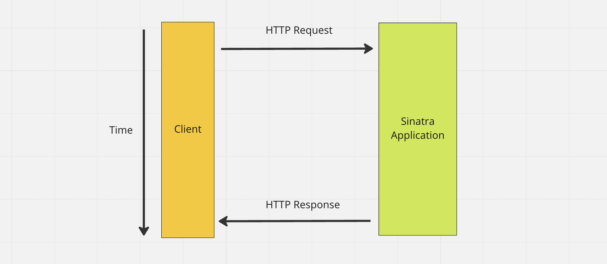

# Creating a sequence diagram for a web application

<!-- OMITTED -->

In this section, you will step away from the code for a bit and learn how to build **sequence diagrams** to present how your program works. This is important for a number of reasons, but mostly:
 * A diagram is easier to digest, present and discuss than a whole program made of written code. It is also easier to modify if it's needed.
 * It will force you to think deeper about what happens in your program, and to explain to yourself (and your peers) how the different components interact. This will become very useful when it comes to debugging too.

**A sequence diagram** for a web application helps us to explain and communicate two important things:
 * The interaction between the different components of the web application (and with the client as well)
 * The order in which the different parts interact together

Here is an example:

On the sequence diagram above, we can see that:
 * the two main components of our system are the Client and the Application (the server)
 * the two interactions happening between them are the HTTP request and response
 * The HTTP request is first sent by the Client to the Application, then the HTTP response is sent back

Note: the Client (a web browser, or a tool like Postman) is technically not a part of our program, but it is part of the broader "system" the program lives in - therefore it is still important to include it.

The diagram shown above still presents at a high-level what is happening in a web application. We can "zoom in" as needed, to illustrate the lower level details. Here is the same web application, illustrated with a different sequence diagram:

This second diagram presents in more details what happens between `rackup`, the Application class, and the route block code. Note that the arrows are not aligned, showing in which order the different interactions happen.

## Exercise

Create a sequence diagram of the program you've created in the previous section. Make sure your diagram all includes the following: 
 * The HTTP Client
 * The HTTP Request and the data it contains
 * The HTTP Response and the data it contains
 * The Application class (`app.rb`)

You can create these diagrams in the diagramming tool of your choice but a nice one for creating specifically sequence diagrams is [diagram.codes](https://playground.diagram.codes/d/sequence).

[Next Challenge](05_test_driving_route_with_database.md)

<!-- BEGIN GENERATED SECTION DO NOT EDIT -->

---

**How was this resource?**  
[😫](https://airtable.com/shrUJ3t7KLMqVRFKR?prefill_Repository=makersacademy%2Fweb-applications&prefill_File=challenges%2F04_creating_a_sequence_diagram.md&prefill_Sentiment=😫) [😕](https://airtable.com/shrUJ3t7KLMqVRFKR?prefill_Repository=makersacademy%2Fweb-applications&prefill_File=challenges%2F04_creating_a_sequence_diagram.md&prefill_Sentiment=😕) [😐](https://airtable.com/shrUJ3t7KLMqVRFKR?prefill_Repository=makersacademy%2Fweb-applications&prefill_File=challenges%2F04_creating_a_sequence_diagram.md&prefill_Sentiment=😐) [🙂](https://airtable.com/shrUJ3t7KLMqVRFKR?prefill_Repository=makersacademy%2Fweb-applications&prefill_File=challenges%2F04_creating_a_sequence_diagram.md&prefill_Sentiment=🙂) [😀](https://airtable.com/shrUJ3t7KLMqVRFKR?prefill_Repository=makersacademy%2Fweb-applications&prefill_File=challenges%2F04_creating_a_sequence_diagram.md&prefill_Sentiment=😀)  
Click an emoji to tell us.

<!-- END GENERATED SECTION DO NOT EDIT -->
