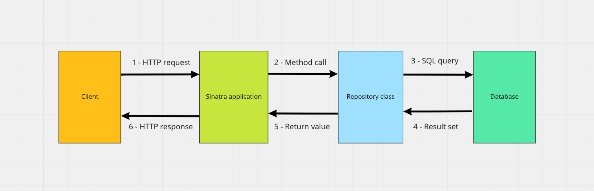

# Test-driving CRUD routes

_**This is a Makers Vine.** Vines are designed to gradually build up sophisticated skills. They contain a mixture of text and video, and may contain some challenge exercises without proposed solutions. [Read more about how to use Makers
Vines.](https://github.com/makersacademy/course/blob/main/labels/vines.md)_

Learn to test-drive Sinatra routes which interact with database-backed classes.

<!-- OMITTED -->

_This section connects together what you've learned working with databases with what you've learned building web applications. It can be quite challenging, so make sure you spend some time to understand the following._

## Intro

So far you've mostly designed routes that return static data. A realistic web server program will usually connect to a database, to read data from it (usually responding to `GET` requests), or write some data into it (usually responding to `POST` requests).

In the next challenges, you'll learn how to use a database-backed Repository class inside your Sinatra application. Here's a simplified schema of how a typical database-backed web application works:



Let's break down an example:
1. The client sends a HTTP request to the web server over the Internet: `GET /albums`
2. The web server (a Sinatra application, in our case) handles the request, and executes the route block, which calls the method `AlbumRepository#all`
3. The Repository class runs a SQL query to the database.
4. The database returns a result set to the program.
5. The Repository class returns a list of `Album` objects to the route block.
6. The route block sends a response to the client containing the data.

The flow described above is what most CRUD web applications will implement, so it is important to get familiar with it, and to have a good mental model on how it works.

## CRUD Resources

We design HTTP routes to map to CRUD operations on the database sitting behind the web server.

For example, we could have the following routes mapped to each operation on the albums database:

```
# Albums resource:

# List all the albums
Request: GET /albums
Response: list of albums

# Read a single album
Request: GET /albums/1
Response: of a single album

# Create a new album
Request: POST /albums
  With body parameters: "title=OK Computer"
Response: None (just creates the resource on the server)

# Update a single album
Request: PATCH /albums/1
  With body parameters: "title=OK Computer"
Response: None (just updates the resource on the server)

# Delete an album
Request: DELETE /albums/1
Response: None (just deletes the resource on the server)
```

In this case, _we say the Albums collection is a "Resource"_ —  we can execute CRUD operations (Create, Read, Update, Delete) on a given Resource, by sending HTTP requests to the right method and path.

You've noticed the mapping above uses other HTTP methods, such as `PATCH` and `DELETE`. They work the same way as `POST`, and we can send query parameters and body parameters with them too.

This pattern of routing is often called **REST**. The key idea behind **REST** is to map HTTP request (method and path) to CRUD operations on the underlying database, as in the example above.

## Path parameters

You might have noticed the route pattern `/albums/1` from the previous mapping — this path contains a "dynamic" part: the album ID.

```
GET /albums/1   -> get album with ID 1
GET /albums/5   -> get album with ID 5
GET /albums/12   -> get album with ID 12
```

But we only know how to handle _query_ or _body_ parameters in Sinatra, so how do we use this? This new kind of parameter is also called a "path" parameter - as a dynamic segment of the path.

Sinatra makes it easy for us, using the following syntax:

```ruby
get '/albums/:id' do
  album_id = params[:id]

  # Use album_id to retrieve the corresponding
  # album from the database.
end

delete '/albums/:id' do
  album_id = params[:id]

  # Use album_id to delete the corresponding
  # album from the database.
end

# etc.
```

## Downloading the program

[Use this provided codebase as a starting point.](../resources/music_library_database_app/) It contains a program that interacts with a database containing a few music albums.

_To use the seed codebase, clone the whole repository of this week's module to your machine, and then access the directory in `resources/music_library_database_app`._

Create a database `music_library` and setup the program.

```ruby
cd music_library_database_app

bundle install

# Make sure the tests pass
rspec

# Run the web server
rackup
```

## Demonstration

[Video Demonstration](https://www.youtube.com/watch?v=WD5aURdrDN4)

## Exercise

Follow the [Design recipe](../resources/sinatra_route_design_recipe_template.md) to test-drive a route `POST /albums` to create a new album:

```
# Request:
POST /albums

# With body parameters:
title=Voyage
release_year=2022
artist_id=2

# Expected response (200 OK)
(No content)
```

Your test should assert that the new album is present in the list of records returned by `GET /albums`.

[Example solution](https://www.youtube.com/watch?v=WD5aURdrDN4&t=1135s)

## Challenge

This is a process feedback challenge. That means you should record yourself doing it and
submit that recording to your coach for feedback. [How do I do
this?](https://github.com/makersacademy/golden-square/blob/main/pills/process_feedback_challenges.md)

**For this challenge, you should only record the 3rd part where you create the diagram.** Make sure you also record yourself talking out loud when making the diagram, to explain it.

Work in the same project directory.

1. **Test-drive a route `GET /artists`**, which returns the list of artists:
```
# Request:
GET /artists

# Expected response (200 OK)
Pixies, ABBA, Taylor Swift, Nina Simone
```

2. **Test-drive a route `POST /artists`**, which creates a new artist in the database. Your test should verify the new artist is returned in the response of `GET /artists`.

```
# Request:
POST /artists

# With body parameters:
name=Wild nothing
genre=Indie

# Expected response (200 OK)
(No content)

# Then subsequent request:
GET /artists

# Expected response (200 OK)
Pixies, ABBA, Taylor Swift, Nina Simone, Wild nothing
```

3. **Create a sequence diagram** explaining the behaviour of your program when a request is sent to `POST /artists`. Make sure your diagram all includes the following:
    * The HTTP Client
    * The HTTP Request and the data it contains
    * The HTTP Response and the data it contains
    * The Application class (`app.rb`)
    * The Repository class (`artist_repository.rb`)
    * The Database

[After you're done, submit your code and recording here](https://airtable.com/shr6mk28x0fy3OrxN?prefill_Item=web_as02_v2).


<!-- BEGIN GENERATED SECTION DO NOT EDIT -->

---

**How was this resource?**  
[😫](https://airtable.com/shrUJ3t7KLMqVRFKR?prefill_Repository=makersacademy%2Fweb-applications&prefill_File=challenges%2F05_test_driving_route_with_database.md&prefill_Sentiment=😫) [😕](https://airtable.com/shrUJ3t7KLMqVRFKR?prefill_Repository=makersacademy%2Fweb-applications&prefill_File=challenges%2F05_test_driving_route_with_database.md&prefill_Sentiment=😕) [😐](https://airtable.com/shrUJ3t7KLMqVRFKR?prefill_Repository=makersacademy%2Fweb-applications&prefill_File=challenges%2F05_test_driving_route_with_database.md&prefill_Sentiment=😐) [🙂](https://airtable.com/shrUJ3t7KLMqVRFKR?prefill_Repository=makersacademy%2Fweb-applications&prefill_File=challenges%2F05_test_driving_route_with_database.md&prefill_Sentiment=🙂) [😀](https://airtable.com/shrUJ3t7KLMqVRFKR?prefill_Repository=makersacademy%2Fweb-applications&prefill_File=challenges%2F05_test_driving_route_with_database.md&prefill_Sentiment=😀)  
Click an emoji to tell us.

<!-- END GENERATED SECTION DO NOT EDIT -->
